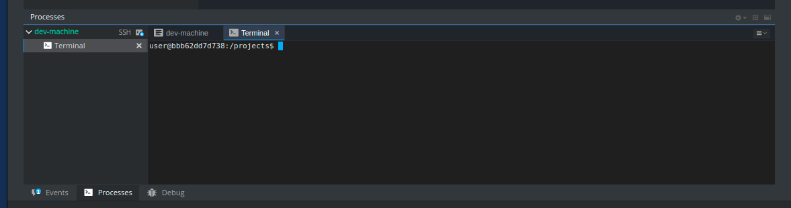
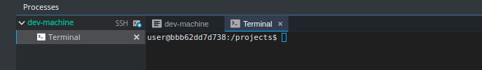

# Conhecendo a linha de comando

Para começar alguns experimentos, precisamos acessar a linha de comando primeiro.

## Codenvy

No Codenvy, a linha de comando já está aberta para você, na parte inferior da sua tela.

## Prompt

Esta janela preta está à espera de seus comandos.

### Sumário 

Aqui vai uma lista de alguns comandos úteis:

| Comando \(Windows\) | Comando \(Mac OS / Linux\) | Descrição | Exemplo |
| :--- | :--- | :--- | :--- |
| exit | exit | Fecha a janela | **exit** |
| cd | cd | Muda a pasta | **cd test** |
| cd | pwd | Mostra o diretório atual | **cd** \(Windows\) ou **pwd** \(Mac OS / Linux\) |
| dir | ls | Lista as pastas e/ou arquivos | **dir** |
| copy | cp | Copia um arquivo | **copy c:\test\test.txt c:\windows\test.txt** |
| move | mv | Move um arquivo | **move c:\test\test.txt c:\windows\test.txt** |
| mkdir | mkdir | Cria uma pasta | **mkdir testdirectory** |
| rmdir \(ou del\) | rm | Exclui arquivo | **del c:\test\test.txt** |
| rmdir /S | rm -r | Exclui diretório | **rm -r testdirectory** |

Esses são apenas alguns dos comandos que você pode rodar na sua linha de comando, mas não vamos usar mais do que isso hoje.

Se você estiver curiosa, [ss64.com](http://ss64.com/) contém uma referência completa de comandos para todos os sistemas operacionais.

### Pronta? 

Vamos mergulhar no Python!

