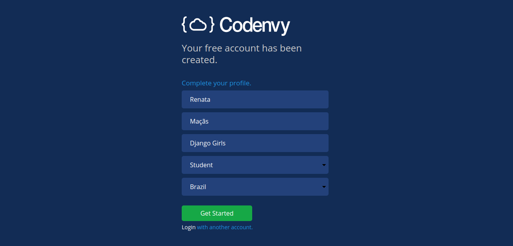

# Dashboard

## Agora, precisamos criar uma área de trabalho para o nosso projeto

Na tela do dashboard, clique na opção _**Create Workspace**_ para criar uma nova área de trabalho.

Na tela que se abriu, identifique a secção _**SELECT STACK**_ e selecione a opção _"Python"_

\_\_

No final da página ou, no cabeçalho, do lado superior direito, clique na opção _**CREATE**"_ para confirmar a criação do ambiente. Uma nova janela com o processamento da criação do ambiente irá surgir e, ao final, aparecerá uma tela __parecida com essa abaixo.

 

Após a confirmação do e-mail. Preencha o formulário para completar o cadastro

