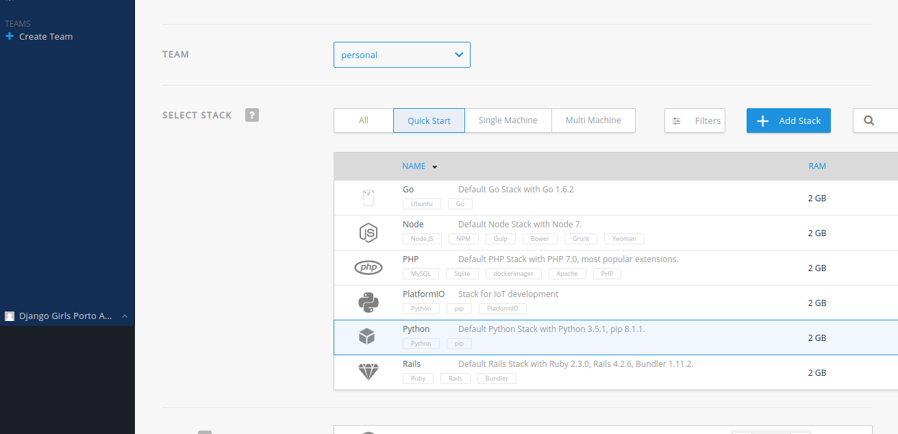
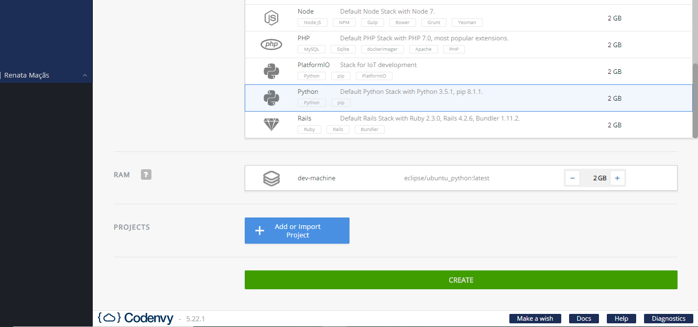
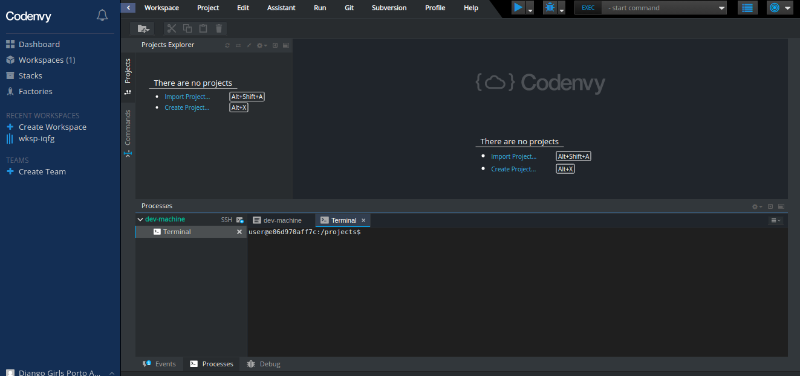

# Dashboard

## Agora, precisamos criar uma área de trabalho para o nosso projeto

Na tela do dashboard, clique na opção '_**Create Workspace'**_ para criar uma nova área de trabalho, no retângulo onde esta escrito **'Recents Workspaces'**.

Na tela que abriu em seguida, identifique a secção _**SELECT STACK**_ e selecione a opção _"Python 3.5.1"_

No final da página ou, no cabeçalho, do lado superior direito, clique na opção _**CREATE**"_ para confirmar a criação do ambiente. 

Uma nova janela com o processamento da criação do ambiente irá surgir e, ao final, aparecerá uma tela parecida com essa abaixo, ou seja nosso computador esta pronto para funcionar e criarmos nosso projeto!!

