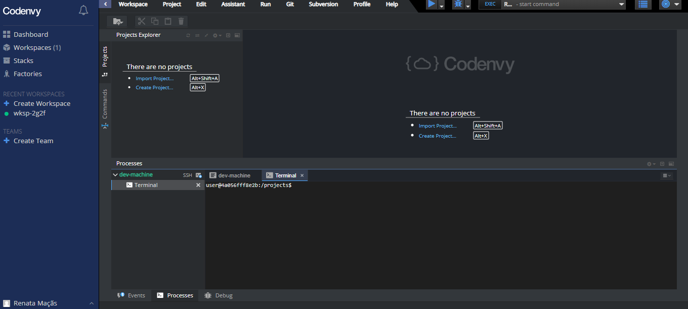
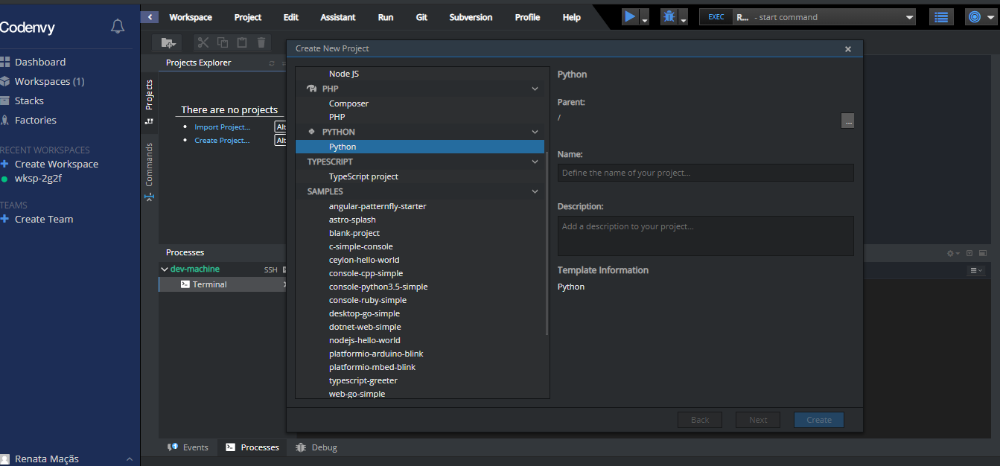
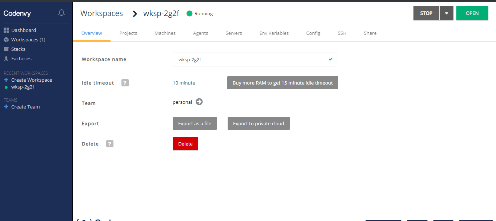

# Workspace

O computador virtual que iremos utilizar se chama 'Workspace', e se parece com a tela abaixo:

Para criar seu primeiro projeto em python, clique na opção create Project, no menu do lado esquerdo da tela, em azul. Assim irá aparecer algumas opções de projeto, selecione 'python' e escreva o nome do projeto 'djangoGirls'

Se por algum momento você não tiver acesso ao workspace, você pode entrar no codenvy novamente e acessar pelo menu esquerdo o 'workspace' e clicar no nome do seu computador virtual, e após clicar em 'open' par abrir a tela com seus projetos

